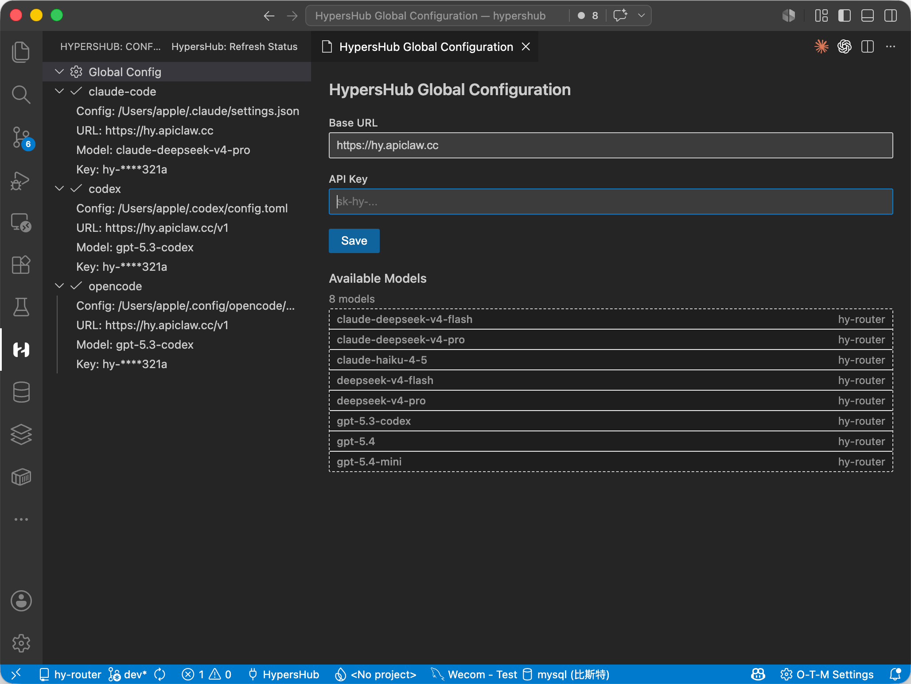
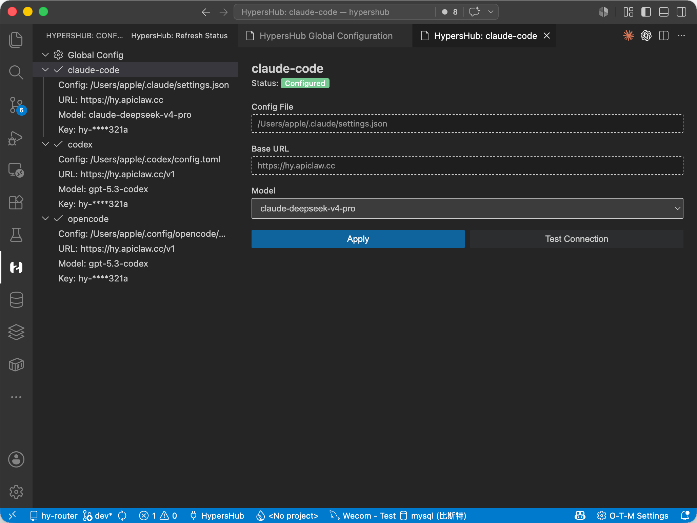
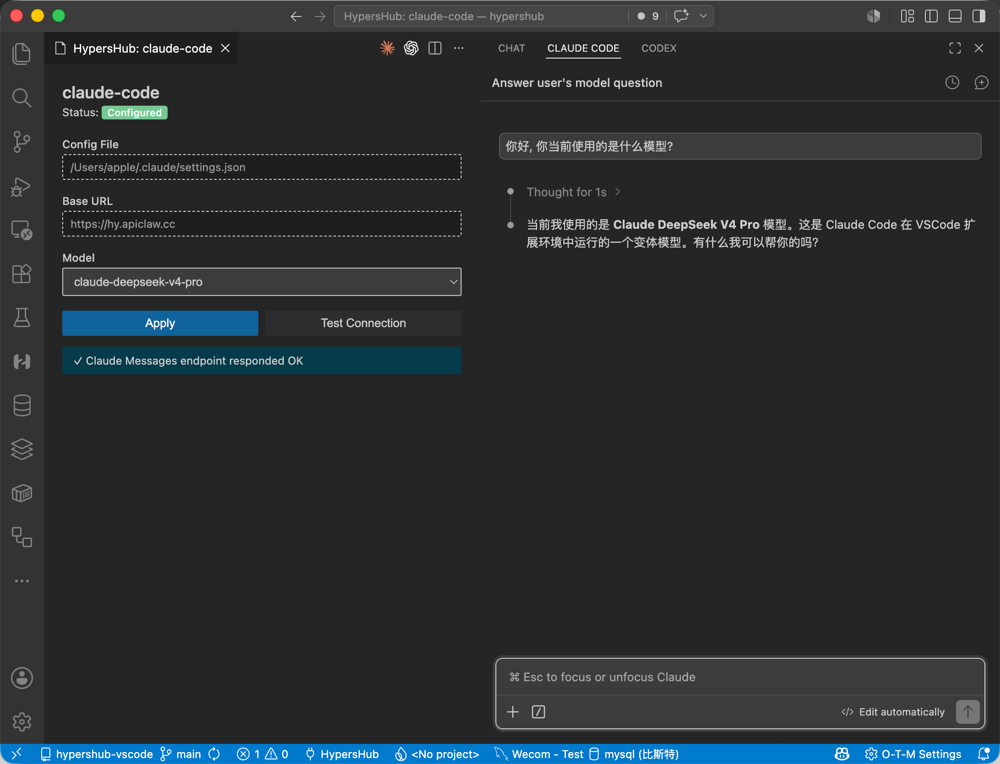

# HypersHub VS Code Extension

[](https://marketplace.visualstudio.com/items?itemName=hypershub.hypershub-vscode)
[](https://marketplace.visualstudio.com/items?itemName=hypershub.hypershub-vscode)
[](LICENSE)

Configure Codex, Claude Code, and OpenCode for HypersHub through a graphical interface — no terminal needed.

## Features

- **Global Configuration** — Manage Base URL and API Key with auto-fetched model list
- **Codex** — Select a model → Apply → writes `~/.codex/config.toml` automatically
- **Claude Code** — Select a model → Apply → syncs `~/.claude/settings.json` automatically
- **OpenCode** — Select a model → Apply → writes `~/.config/opencode/opencode.json` automatically
- **Connection Test** — Prompted automatically after Apply, or run manually
- **Status Overview** — TreeView shows configuration status at a glance

## Installation

```bash
code --install-extension hypershub.hypershub-vscode
```

Or search **HypersHub** in the VS Code extensions marketplace.

## Usage

1. **Open the configuration panel** — Click the HypersHub icon in the Activity Bar to see the Configuration Status panel.

2. **Configure Base URL and API Key** — Open **Global Config**, enter your Base URL and API Key, and click Save.

   

3. **Configure an integration** — Click an integration (Codex / Claude Code / OpenCode), select a model, and click **Apply**. The extension automatically writes the configuration file for the selected tool.

   

4. **Verify the connection** — After Apply, you will be prompted to test connectivity. Click **Test** to confirm the configuration works, or ask a question directly in Claude Code or Codex.

   

## Requirements

- VS Code 1.85+
- Node.js 20+

## Links

- [GitHub](https://github.com/hypershub/hypershub-vscode)
- [Marketplace](https://marketplace.visualstudio.com/items?itemName=hypershub.hypershub-vscode)
- [HypersHub SDK](https://github.com/hypershub/typescript-sdk)
- [HypersHub CLI](https://github.com/hypershub/hypershub-cli)

## License

MIT
